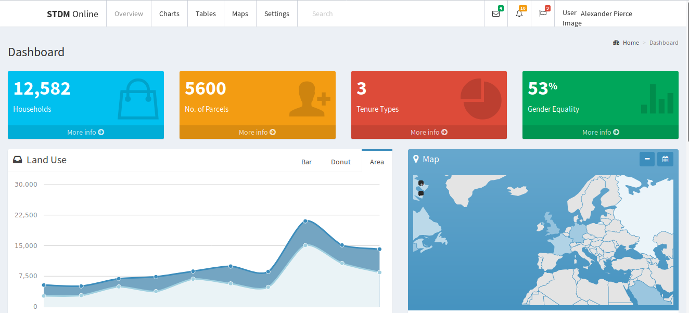

Introduction
============

[](https://travis-ci.org/ColorlibHQ/AdminLTE)

[](https://www.npmjs.com/package/admin-lte)
[](https://packagist.org/packages/almasaeed2010/adminlte)
[](https://cdnjs.com/libraries/admin-lte)

**STDM Online** -- platform comprises spatial data that represent the boundaries of land tenure and provides a vital base layer for integration into other spatial information systems i.e. **[STDM2 Plugin](https://github.com/gltn/stdm2)** and STDM Mobile that permits users to retrieve, create, update, store, analyze and visualize data through intuitive dashboards.



**Demo [STDM Online](https://stdm2.ngenokevin.com)**

## Documentation & Installation Guide
Visit the [online documentation](https://gltn.github.io/stdm2-online) for the most
updated guide.

### Contribution
Contribution are always **welcome and recommended**! Here is how:

- Fork the repository ([here is the guide](https://help.github.com/articles/fork-a-repo/)).
- Clone to your machine ```git clone https://github.com/YOUR_USERNAME/AdminLTE.git```
- Make your changes
- Create a pull request

#### Contribution Requirements:

- When you contribute, you agree to give a non-exclusive license to STDM Online to use that contribution in any context as we (STDM Online) see appropriate.
- If you use content provided by another party, it must be appropriately licensed using an [open source](http://opensource.org/licenses) license.
- Contributions are only accepted through Github pull requests.
- Finally, contributed code must work in all supported browsers (see above for browser support).

### License
STDM Online is an open source project by [STDM Online](https://gltn.github.io/stdm2-online) that is licensed under [GPL v3](https://www.gnu.org/licenses/old-licenses/gpl-3.0.en.html). STDM Online reserves the right to change the license of future releases. Wondering what you can or can't do? View the [license guide](https://gltn.github.io/stdm2-online/docs/license).
